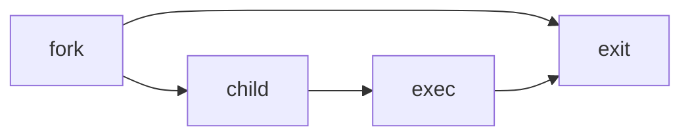

Systems Programming(SP) 筆記  
===  
2024 Fall 台大資工系必修 老師：鄭卜壬  

1. OS Concept & Intro. to UNIX  
2. UNIX History, Standardization & Implementation  
3. File I/O  
4. Standard I/O Library  
5. Files and Directories  
6. System Data Files and Information  
7. Environment of a Unix Process  
8. Process Control  
9. Signals  
10. Inter-process Communication  
11. Thread Programming  
12. Networking  

# ch1 UNIX System Overview  

`/etc/passwd` contains login names, encrypted passwd, uid, gid, home dir, **shell program**  

# ch3 File I/O  

P.14~  

## File Descriptor  

### Reference Count  

system file table只會在`fork`、`dup`或`dup2`才會增加，否則就算同個process開同個檔案很多次也會開很多個entry  

## open, openat  

### openat:  

`int openat(int fd, const char *path, int oflag, ... /* mode_t mode */ );`  
開啟時相對fd  
如果path是絕對路徑，那就和open一模一樣。但若是相對路徑，比如要創建並開啟`/tmp/abc/def.txt`，先開好`/tmp/abc`的fd，此時若別人把`/tmp/abc`刪掉並重新創建一個symbolic link指向一個不安全的路徑（比如他的資料夾），用fd存取就能避免寫入到錯誤的資料夾內。但未必是真正的atomic，因為別人還是可能在中途刪除`/tmp/abc`，並使fd變成dangling file descriptor。  
>Time-of-check-to-time-of-use (TOCTTOU):  
>atomic，在運作時若工作目錄改變不會受影響，對安全性或效能有幫助，尤其是多線程。  

### mode:  

只有在檔案不存在而且O_CREAT有開的時候會新建一個符合mode的檔案  

### (non-)block mode  

* block mode: 比如要讀10 bytes，buffer cache不夠，process就會被suspend。  
* non-block mode: 盡可能讀，有可能不完整，或有`EAGAIN`或`EWOULDBLOCK`的錯誤。  
在pipe、terminal特別明顯，read write時可能會比較麻煩。  

在檔案操作中，**資料同步（data synchronization）** 涉及將檔案的數據從暫存區（buffer cache）寫入到磁碟或其他永久儲存設備，以確保數據的持久性。`open` 的系統呼叫中有與同步相關的選項，可以用來控制數據何時真正地被寫入磁碟，這主要影響檔案系統的可靠性和效能。  

### Data Synchronization  

確保資料在每次寫入後立即存到磁碟以防丟失  
system calls:  

* fsync(filedes): data+attr  
* fdatasync(filedes): data  
* sync  
    * queues all kernel modified blocks(return immediately)  
    * called by daemon & command `sync`  

open options:  

- **`O_DSYNC`**: 每次write都等I/O，只寫會影響read的元數據，比 `O_SYNC` 快一些。  
- **`O_RSYNC`**: 讀之前確保要讀的部分的寫入都寫完  
- **`O_SYNC`**: 每次寫入後資料會馬上寫入磁碟，降低效能但更安全。  

### Misc  

open always returns the lowest unopened descriptor: 回收已經close的descriptor  

## lseek  

移動目前的current file offset（讀寫頭），儲存在open file table  
* `SEEK_SET` 開頭  
* `SEEK_CUR` 目前  
* `SEEK_END` 結尾  

### weird things  

* `lseek(fd,0,SEEK_CUR)`: 取得目前current file offset  
* seek past the end of the file: 產生hole  

## Atomic Operations  

避免Time-of-check-to-time-of-use (TOCTTOU)的問題:比如兩個process都先lseek到SEEK_END再寫入，可能會出錯。  

### pread  

=`lseek`+`read`  

### pwrite  

=`lseek`+`write`  

## dup&dup2  

### dup  

Return the lowest available file descriptor.  

### dup2  

atomic  

## fork  

fork後，child和parent一起跑，child可能會exec，exit後回到parent wait的地方  

## Efficiency  

為甚麼RealTime-(UserCPU+SysCPU)會隨著buffer size增加而增加？從buffered 1:2s, unbuffered 8192:6s  
**read-ahead效果**:一次一個byte UNIX會先讀後面的block，一次太多的話可能來不及。  
Here's a refined and improved version of your notes with minor corrections and added clarifications:  

---  

  
:::spoiler AI generated notes  
### Chapter 3, p.62 ~ FILE I/O  

- **O_SYNC** → `fsync` (file descriptors)  
  - Forces all modified data and metadata of a file to be written to storage immediately. Equivalent to using `sync()` which also flushes the buffer cache.  

- **O_DSYNC** → `fdatasync` (file descriptors)  
  - Similar to `O_SYNC`, but only data (not metadata) is synchronized, which can be more efficient. Commonly used by daemons or the `sync` command to update file changes on disk.  

- **daemon** | Background process that runs independently of terminal sessions.  

- **fcntl** | Modify file descriptor properties, duplicate descriptors, or set/get file flags.  
  - **Flags**:  
    - `FD_CLOEXEC` | Close file descriptor on `exec` calls, preventing leakage of descriptors to child processes.  
    - File status flags (e.g., `O_APPEND`) modify behavior at the file level.  
    - `procID`, `groupID`, and `file lock` allow control over process ownership and access.  
    - **Access modes**: `O_RDONLY`, `O_WRONLY`, `O_RDWR` control read/write permissions.  

- **dup** | Duplicates a file descriptor.  
  - Example: `dup2(fd, F_DUPFD)` creates a duplicate starting at a specified index.  

- **ioctl** | Input/Output control, often used to manage device settings, such as terminal size, or to apply additional security measures.  

---  

### Examples  
- **`/dev/fd`** | Special device file representing open file descriptors.  
  - Example: `open("/dev/fd/0", mode) = dup(0)` replicates the standard input.  

---  

### Chapter 4, p.1 ~ Advanced I/O  

- **Slow System Calls** | Can block a process indefinitely if resources are unavailable.  
  - Examples: Pipes, terminal input, and network operations may wait for data or user actions.  

- **Disk I/O** | Processes can block waiting for disk I/O indefinitely unless interrupted or the disk becomes unresponsive.  

- **Terminal Mode**  
  - **Canonical Mode**: Input is buffered and processed line-by-line.  
  - **Non-canonical Mode**: Also known as raw mode, allows character-by-character processing, commonly used for real-time applications.  
  - **R/W from/to disk is never a slow system call**  

---  

### I/O Multiplexing  

- **Purpose**: Monitor multiple file descriptors simultaneously without being blocked by any specific one. This is essential for applications handling multiple I/O sources, like servers.  

- **`select` System Call**  
  - Used to monitor multiple descriptors for readability, writability, or exceptional conditions.  
  - Parameters:  
    - `readfds`, `writefds`, `exceptfds` | Specify the sets of file descriptors to monitor.  
  - Network applications often rely on `select` to handle connections or socket data.  

- **Macros**:  
  - `FD_ZERO`, `FD_SET`, `FD_ISSET`, `FD_CLR` are used to manage file descriptor sets.  
  - Example Usage:  
 ```c  
    ready_count = select(nfds, &readfds, &writefds, &exceptfds, &timeout);  
 ```  
  - `ready_count` represents the number of ready descriptors, which the program can process sequentially.  

- **Timeouts**:  
  - `select(0, NULL, NULL, &timeout)` | Sleeps for the specified time (in microseconds) without checking descriptors.  
  - Alternative: `usleep()` and `sleep()` can also provide delays (in seconds or microseconds).  

- **`poll` System Call**  
  - An alternative to `select`, where descriptors are defined in an array of `struct pollfd`.  
  - Allows specifying event types (`POLLIN` for readable, `POLLOUT` for writable).  
  - Example: `poll(array[], length, timeout)`.  

- **Variants**:  
  - **epoll**: More efficient for a large number of descriptors, commonly used in Linux.  
  - **pselect**: A variation of `select` with an additional signal mask for handling interruptions.  
:::  

# ch14 Advanced I/O  

## blocking vs nonblocking  

* blocking: not return until done  
* non-blocking: return immediately, return what has been done  

Slow system calls: may block forever  
* R/W on pipes(input/output may not be ready forever)  
* terminal devices  
* network devices  

## I/O multiplexing  
同時處理多file，可能會block(不用non-blocking 因為太耗CPU)  
**system call**  
* `select`: specify readfds, writefds, errorfds, timeout  
struct fd_set: FD_SET, FD_ZERO, FD_ISSET  
`ready_count=select(length, readfds, writefds, errorfds, timeout)`  
ready的東西會變成1，其他0  
* `poll`: use array of pollfd(fd,events,revents). Better then `select`(reuse input, better with few high fds, more types)  
## File Lock  

### Ways to Lock  

* flock: lock整個file  
* fcntl: 可以lock檔案的某些bytes  
* lockf: built on fcntl  

### Types of Lock  

* shared read lock  
    * any read lock exists, deny write lock  
    * any read lock exists, allow read lock 實務上會看有沒有write lock，避免starving  
* exclusive write lock  

### Release of lock  

**只要(process, file)對了就會release**，像是  
```c  
fd1 = open(filename,...)  
read_lock(fd1,...)  
fd2 = dup(fd1)  
close(fd2)  
```  
```c  
fd1 = open(filename,...)  
read_lock(fd1,...)  
fd2 = open(filename,...)  
close(fd2)  
```  
都會把lock release  
因為實現方法是把lock記在某檔案的i-node的一個linked list，每個lock有對應的process  
**所以一個process開同檔案很多個fd要小心**  

### Advisory vs. Mandatory  

* Advisory:只是建議，別人不一定要管  
* Mandatory:每次read write都先檢查有沒有鎖，很耗時間  
Linux and SVR3: set-group-id on, group x off  

# ch5 I/O Library  

## buffered vs. unbuffered  

* File Pointers vs File Descriptors  
* stream  
* FILE object: fd, pointer, buffer, buffer type, buffer size, error/EOF flag, etc.  
* stdin, stdout, stderr vs STDIO_FILENO, STDOUT_FILENO, STDERR_FILENO  

## system calls  

* `FILE *open(path,type)`: normal open  
* `FILE *freopen(path,type,FILE *fp)`  
    * close fp, clear orientation(multibyte words)  
    * `freopen(file,type,stdout)` $\approx$ `int fd=open(file,mode);dup2(fd,1);close(fd);`  
* `FILE *fdopen(filedes, type)`: for existing files, no truncate for w. Usually for pipes, network channels  
* `fileno(FILE *fp)`: get file descriptor  
* `fclose(FILE *fp)`  
    * flush output  
    * discard input  
    * all fps are closed after the process exits  
    * **buffer must be valid**(don't set buf to local variable)  

### Buffering  

* fully-buffered  
* line-buffered  
    * 例外:scanf after printf(without \n), will trigger I/O  
* unbuffered  

depends on the output type  

* stdout and stdin are fully buffered unless interactive devices(terminal): line-buffered  
* stderr: unbuffered  
* File: fully-buffered  

### Synchronize Data  

`int fflush(FILE *fp)`: send buffer in user space to buffer cache  

### Set buffer  

Any operations on streams will have OS allocate a buffer.  

* `void setbuf(*fp,*buf)`  
    * size=BUFSIZE(defined in stdio.h)  
    * not specify mode(depend on fp,buf)  
        * fp=terminal: line-buffered  
        * buf=NULL: unbuffered  
* `int setvbuf(*fp,*buf,mode,size)`  
    * buf=NULL: auto  
    * mode: \_IOFBF, \_IOLBF, \_IONBF  

### Positioning  

* `long ftell(*fp)`: get current file offset (review=`lseek(fd,0,SEEK_CUR)`)  
* `int fseek(*fp,offset,whence)`: =`lseek`  
* `void rewind(*fp)`: =`fseek(*fp,0,SEEK_SET)`  
* For different types:  
    * `off_t`: `fello`, `fseeko`  
    * `fpos_t`: `fgetpos`, `fsetpos`  

### Read/Write  

#### Unformatted  

##### Character-at-a-time  

* `int getc(*fp)`: maybe a macro  
* `int fgetc(*fp)`  
* `int getchar(void)`=`getc(stdin)`  
-1 for EOF or error(call some function to check it)  
> `char` may be signed or unsigned(system dependent)  
> So do NOT write `char c; while((c=getchar())!=EOF)...`, just use `int` as instructed.  

About error and EOF:  
error and EOF flags are stored in `FILE`  
* `int ferror(*fp)` and  
* `int feof(*fp)`: non-zero=true, zero=false  
* `void clearerr(*fp)`: clear both  

- `ungetc(c,*fp)`: c cannot be EOF, clear EOF flag, stored in the buffer  
Ex: skip spaces before character: By reading and checking if is space until is not and put it back.  

`putc(int c,*fp)`, `fputc(int c,*fp)`, `putchar(int c)`: same as reading(all `int`)  

##### Line-at-a-Time  

* `char *fgets(*buf,n,*fp)`: **include `\n`**, return partial line(n-1 bytes) if the line is too long  
* `char *gets(*buf)`: from stdin, not include `\n`, no buf size$\Rightarrow$may overflow ***unsafe***  
差別:有沒有讀**換行**、是否指定大小  

write is not really "Line-at-a-Time"  
* `fputs(char *str,*fp)`: Output includes `\n` in the string.  
* `puts(char *str)`: **terminated by null**, output a `\n` at the end.  

##### Direct/Binary I/O  

R/W some objects of a specified size  
alias: object-at-a-time I/O, record/structure-oriented I/O  

* `size_t fread(*ptr,size,nobj,*fp)`: 讀取nobj個size為bytes的object到ptr  
* `size_t fwrite(*ptr,size,nobj,*fp)`: 同上  

缺點:Not portable，implement depends on系統，只保證同系統可以讀寫。像是可能有padding，也可能同型別具體儲存方式不一樣。  

#### Formatted  

* `int scanf(const char *format,...)`  
* `int fscanf(FILE *fp, const char *format,...)`  
* `int sscanf(char *buf, const char *format,...)`  

- `int printf(const char *format,...)`  
- `int fprintf(FILE *fp, const char *format,...)`  
- `int sprintf(char *buf, const char *format,...)`: may overflow, use `snprintf` instead  
- `int vprintf(const char *format, va_list arg)`  
- `int vfprintf(FILE *fp, const char *format, va_list arg)`  
- `int vsprintf(char *buf, const char *format, va_list arg)`  

* v版本: va_list，變動參數的實作方式  
* 無印: stdin, stdout  
* f: fp  
* d: fd  
* s: to/from `char* buf`  
* n: 指定長度  

:::spoiler output format details  
`%[flags][fldwidth][precision][lenmodifier]convtype`  
* flag  
    * `,`: 千位一撇  
    * `-`: 置左  
    * `+`: 顯示+  
    * ` `: 沒有符號則加一個空格在前面  
    * `#`: alternative form。如16進位加入0x、浮點數無小數部分則加入小數點  
    * `0`: 用0 padding  
* fldwidth 總寬度，會用space padding，用`*`表示在參數前指定  
* precision `.number`，用`.*`表示在參數前指定(`printf("%.*f",3,a);`)  
* lenmodifier 略過  
:::  

> some functions are with **no range-checking problems**, DO NOT USE  
> * strcpy(char *dest, const char *src)  
> * strcat(char *dest, const char *src)  
> * gets(char *s)  
> * sprintf(char *buf, const char *format, …);  

### Interleaved R&W restrictions  

Need to make R/W pointers consistent, touch current offset  
Output [ `fseek` | `fsetpos` | `rewind`| `fflush`] Input  
Intput [`fseek` | `fsetpos` | `rewind` | `EOF`] Output  
```  
fread(&c,1,1,fp);  
//fseek(fp,0,SEEK_CUR);  
fwrite(&c,1,1,fp);  
```  
Without `fseek`, the result may depend on OS.  
One bad solution: open 2 fp for the same fd(fdopen), where each for read and write.  

# ch4 Files and Directories  

## information stored in i-node  

dump with stat, fstat, lstat  
`lstat` returns info about the symbolic link, rather than the reference file.  

| type            | name       | description                      |
| --------------- | ---------- | -------------------------------- |
| mode_t          | st_mode    | file type & mode (permissions)   |
| ino_t           | st_ino     | i-node number (serial number)    |
| dev_t           | st_dev     | device number (file system)      |
| dev_t           | st_rdev    | device number for special files  |
| nlink_t         | st_nlink   | number of links                  |
| uid_t           | st_uid     | user ID of owner                 |
| gid_t           | st_gid     | group ID of owner                |
| off_t           | st_size    | size in bytes, for regular files |
| struct timespec | st_atim    | time of last access              |
| struct timespec | st_mtim    | time of last modification        |
| struct timespec | st_ctim    | time of last file status change  |
| blksize_t       | st_blksize | best I/O block size              |
| blkcnt_t        | st_blocks  | number of disk blocks allocated  |

## file types  

* regular: binary, text  
* directory: only kernel can update ({filename, pointer})  
* character special files: tty, audio  
* block special files: disks  
* FIFO  
* sockets  
* symbolic links  

check with `S_ISREG()`, `S_ISDIR`,etc.  

## permission & UID/GID  

directory  
* R: list files(can only dump info)  
* W: update(delete, create a file(X is also required))  
* X: pass through(search bit, can check each entry)  

file  
* R: read  
* W: write  
* X: execute  

## set-user-id, set-group-id  

執行檔把擁有者的權限借給執行者，跑起來effective user id會是file owner  
User/group id:  

* real: 真正的執行者(access是看real user)  
* effective: 檢查file permission是看effective  
* Saved set-user/group id: stored by exec, 把effective id改回去(ch8)  

- set-user-id: 04000, `S_ISUID` in st_mode, `--s --- ---`, `S` if X is not set  
- set-group-id: 02000, `S_ISGID` in st_mode, `--- --s ---`, `S` if X is not set  
## check permission  

> Q: How to share files without setting up a group?  
> A: Set directories `rwx--x--x`, only my friend knows the file name, other users cannot list files.  

> Q: 老師發現成績檔案的others write權限沒關，關完確定內容沒錯，但還是被改了？！  
> A: 只會在open時確認permission，所以壞學生開好後不關process，等到老師確認完再改。  
1. Is effective UID is superuser? -> yes  
2. Is effective UID the UID of the file? -> Check owner permission  
3. Is effective GID or any of the supplementary groups the GID of the file? -> Check group permission  
4. check others permission  

## owner of a new file  

* UID=effective UID  
* GID=  
    * effective GID  
    * GID of directory  
        * Some OS always do, some need the set-group-id of the directory, ex: `/var/spool/mail`  

SVR3 & Linux provide mandatory locks by **turning on set-group-id** but **turning off group-X**.  
Therefore, the superuser checks if some files have set-user/group-id,**especially those owned by root!** (by `find`)  

## access  
`access(path,mode)`  
mode:`R_OK`,`W_OK`,`X_OK`,`F_OK`(existence)  
Check the real UID/GID. Ex: A set-user-id program wants to check if the real user can access the file.  
## umask  

user file creation mask  
預設新file是666，新directory是777，在process跑`umask(x)`後之後跑都會變成666&~x, 777&~x。也就是把某些mode**關掉**  
mask從parent inherit，改了自己的不影響parent的  

**return**: previous mask  

## chmod, fchmod  

`chmod(path, mode)`  

### sticky bit  

以前硬碟很慢，為了讓電腦一直執行同一個執行檔，把它sticky bit設為1，把執行檔存在swap area。現在被virtual memory取代。  
**現在的用處**:如果一個directory的sticky bit被set，裡面的檔案只有在process有**寫入權限**並且符合以下其一才能**刪除或rename**  
* 擁有該file  
* 擁有該directory  
* 是superuser  

> 因此雖然`/tmp`是777，但它有sticky bit，所以不能亂刪別的user的檔案  

### security issues  

* Only the superuser can set sticky bit, otherwise will be turned off.  
* If GID of new file $\neq$ effec. GID (and is not superuser), clear set-group-id. (所以owner不會亂借權限)  
* Clear set-user/group-id if a normal user(non-superuser) writes to a file.  

#### 表示方法  

`--- --- --t`  
有s、t出現要特別小心  

#### swap area  

放進去就不會刻意刪掉，因為會盡量連續儲存，讀取會比較快。  

#### fchmod  

已經被open的版本，傳入file descriptor(f開頭都是這個意思)  

#### lchmod  

不follow symbolic link，修改link檔案本身(l開頭都是這個意思)  

## chown, fchown, lchown  

## Limits  

* Compiler-time: ex: range of short  
* Run-time:  
Can be queried by process  
 * Related to file/dir, `pathconf(path, name)`  
 ex: maximum bytes in a filename  
 (or `fpathconf` for filedes)  
 * Others, `sysconf(name)`  
 ex: maximum # of opened files per process  

## truncate  

把檔案的後面砍掉  
`truncate(const char* pathname, off_t length)`:只留下前length bytes  

## UNIX file and directory  

### structure  

根目錄下有各種資料夾，裝置也會是一個file，disk partition可以mount到directory  
Hard Drive:  
* partition:每個是一個file system  
    * boot blocks  
    * superblock: metadata  
    * cylinder groups  
        * superblock copy  
        * cg info  
        * i-node map  
        * i-nodes  
            * i-node  
        * (Data block map)  
        * Data blocks  

map概念:每個bit記i-node/data block是否被用  
i-node要記很多東西，比如owner, type, file size, 佔了哪些block  
dir block: link to i-node, filename  

> * 邏輯大小>data block size:用lseek到很後面寫入會造成hole  
> * 邏輯大小<data block size:占不完整的block  

>root的parent是誰？implementation issue，可能是自己，可能是特殊值  

#### 檔案操作  
* 刪除檔案  
unlink，Link count-1，在那個path不見，但相同的檔案還有可能有其他hard links  
* 移動檔案  
把directory的data block中entry改一改就好  

#### example 4.4BSD i-node  

* mode  
* owner  
* timestamp  
* size  
* direct blocks，每個直接指向一個block  
* single indirect，指向一個blcok，其中都是direct blocks  
* double indirect，指向一個blcok，其中都是single indirect blocks  
* triple indirect，指向一個blcok，其中都是double indirect blocks  
* **lock**: review: releasing lock only check if (proc, file).  
* ...  

> du的大小包含indirect blocks  
> 會把indirect cache起來，所以未必每次access block都會多走幾層  

i-node number: st_ino  

### hard link vs. soft link  

* hard link:把i-node number抄過去，不可跨fs，只有superuser可以建directory的hard link  
* soft link:在捷徑檔中記住絕對路徑, 可跨fs  

如果dir中有個soft link連到dir，為了避免traverse中一直重複走下去，可以**記i-node**或**限制走soft link的次數（4.3BSD 8次）**  

各種function不一定follow soft link，像是remove就會刪捷徑（不follow），open會開到指向的檔案（follow）  

### link/unlink  

`int link(existing_path, new_path)`  
`int unlink(path)`  
指hard link  
把i-node hard link counts -1  
常用skill:要使用暫存檔可以open後馬上unlink，雖然可以讀寫、會佔系統硬碟大小，但無法用ls找到  

> 老師的反制:把原本權限沒設好的檔案unlink，創一個新的檔案同樣名稱。更謹慎的話也把修改時間竄改，讓學生看不出來。  

> 不同的reference count:  
> * i-node hard link counts:有多少filename指向它  
> * system open file table reference count:有多少file descriptor指向它(複習:dup或fork時增加，開同個檔案不變)  

### remove, rename  

* `remove`: unlink for file, rmdir for dir  
* `rename`: dir to dir, file to file  

### symbolic link  

* `int symlink(const char *actual_path, const char *sym_path)`  
* `int readlink(const char *pathname, char *buf, int buf_size)`  
Get the actual path in buf. Involves open, read, close. No `\0` at last.  

### File times  

* `st_atime`:last access  
* `st_mtime`:last modify  
* `st_ctime`:last modify i-node(chmod, chown)，沒有system call可竄改  

影響時間的操作  
* create、remove、rename、(un)link file會設a、m、c影響包含的directory的m、c  
    * 原則:要改dir的dir block，因此i-node也要改大小  
* 改permission、owner只會影響i-node -> c  
* open file:  
    * 還沒讀寫不會有a、m  
    * `O_CREAT`才會有a  
    * `O_TRUNC`不需要a，只有m、c  

system call:`utime`改變時間  

### Functions for directory  

* `int mkdir(path, mode)`  
* `int rmdir(path)`  
* `DIR *opendir(path)`  
* `struct dirent *readdir(DIR *dp)`，dirent包含很多東西  
* `void rewinddir(DIR *dp)`  
* `int closedir(DIR *dp)`  

### ftw  

file tree walk  
`int ftw(char* dir_path, *fn(char* f_path,stat *sb,type_flag), n_openfd)`  
* dirpath要開的資料夾  
* fn找到新檔案會呼叫的函數  
* nopenfd允許開啟的fd數量，太少tree又太深的話就會只留下面幾層，每次要換目錄就得要從dirpath重新開始，浪費時間  

### chdir fchdir getcwd  

process有current walking directory(CWD)，就是記device id和i-node number  
和`umask`一樣要是built-in command，因為current walking directory和user file creation mask一樣是independently inherit from parent。所以如果是一個執行檔，執行起來只會改child process的這兩個變數。  

> `chdir` follows soft link:因為讀的是檔名，從根目錄開始找i-node，「輸出」是i-node  
> `getcwd` doesn't follow soft link:因為只能從現在目錄的i-node traverse上去，輸出是檔名  


# ch8 Process Control  



## pid  

可能會開一個檔名為pid的檔案用來存tmp資料  

Special process  
* 0: swapper  
* 1: user process  
* 2: virtual memory管理  

## Booting  

Bootstrapping  

* 關機時開機:cold boot  
* ROM存的code讀取要開的系統的boot program  
* 讀取kernel，把主控權給他  
* kernel開始configure devices  
* 初始化系統  
* 開始single-user mode(root)，做一些必要的事  
* 跑初始script  
* 開始multi-user mode  

## Process Control Block (PCB)  

會有個table存所有process的資訊，每個entry是一個PCB:  
* process state:  
    * ready:資料在memory  
    * waiting/block: I/O etc  
    * Running  
* program counter:跑到哪個指令  
* CPU regiester:CPU狀態(context switch 回去要能繼續跑)  
* CPU scheduling info\:process的優先度etc  
* memory-management info\:OS會教  
* Accounting info:跑多久etc  
* I/O status info:開了哪些檔案etc  

sys/proc.h有一個struct proc  

## Process Scheduling Queues  

把PCB串起來  

* job queue: 所有proc  
* ready queue:  
* device queue: 等某I/O的proc  

## Process Metadata & Content  

每個proc都要有  
* metadata: PCB  
* content: virtual memory(VM)  

## system call  

```  
#include <sys/types.h>  
#include <unistd.h>  
pid_t getpid(void)  
pid_t getppid(void)  
uid_t getuid(void)  
uid_t geteuid(void)  
gid_t getgid(void)  
gid_t getegid(void)  
```  
no error return  

## Process Creation & Termination  

要開process都得要fork  
fork()->(parent)->wait->(resume)->  
      \>(child)->exec->exit->把wait叫醒  
wait:等小孩死掉，可能等到死  
PCB有放return status，所以小孩死了PCB還不能馬上刪，如果parent死了會變殭屍孤兒  

## fork  

return pid  
call一次，在parent return一次，在child return一次  
* pid 0不會出現，所以當作特別作用:此proc是小孩(可以用`ppid`得到parent id)  
* \>0:parent，是小孩的pid，只會在這出現一次  

PCB會改所以不能直接繼承，但VM差不多所以可以  
child會從fork return開始跑  
process的VM會依照page table(ch7)對應到physical memory，如果fork時全都複製，cost太高。所以一個proc要改東西時才複製(copy on write)  
馮諾伊曼架構:運行時不會改instruction，所以共用VM中的text會很有用  

大部分東西會繼承，但有些顯然不能繼承:  
* return value  
* pid  
* parent pid  
* running time  
* file locks  
* ...  

## vfork  

避免fork把所有東西複製一份浪費時間，直接把parent的memory與child的共用，但現在有copy on write所以沒用了。  
算是殘廢的shared memory  
如果`exit`，parent的file descriptor會被偷偷關掉，所以要`_exit`  

> train: select->read中間要搞成non-blocking  

## Deadlock 死結  

兩個以上的process在等對方結束，但因此都不會結束  

## process termination  

C程式隨時可以`_exit`、`_Exit`(分別是ANSI、POSIX，沒什麼差)自殺，而`exit`先額外:  
* 會倒序呼叫exit handler  
* flush, close I/O  

> Core=memory, eg core dumped  

### exit handler  

```  
int atexit(void (*func)(void))  
```  
register一個exit handler  

### 正常死亡  

* exit  
* _exit,_Exit  
* return from main()  

### 不正常死亡  

都是signal，像是abort，system會送一個signal給proc。要自殺只能叫UNIX殺自己。  

### wait, waitpid  

* `pid_t wait(int *statloc)`:等其中一個小孩死  
* `pid_t waitpid(pid_t pid, int *statloc, int op)`:等自己的某個小孩死  
error when 沒小孩、pid非小孩  

Actually, wait child process 狀態改變(正常死亡termination status)，（比如suspend:一個scanf程式被跑到background，不可能讀取到）  
`wait3` `wait4`:讀取更多資訊（user/CPU time etc）  

## Zombie & Orphan  

* Zombie:一個proc死掉，VM可以丟掉，但PCB要留著，等parent wait把他狀態拿走的期間。exit前parent wait，小孩短期內會是zombie  
* Orphan:parent死掉，會被init領養  

### How to create a background process without making a zombie?  

Double fork  
因為UNIX希望要wait，所以直接拿child會有問題。  
開一個child，專門拿來開grandchild，child生完就趕快死，這樣grandchild就被init領養，與原本parent就無關了。  
(open source)應用:main立刻  
```c  
if(fork()>0)exit(0);  
```  
則會直接在background執行  
related: session group(ch9)  

## Race Conditions  

很多process要用同個資源，結果會depend on執行順序  
Ex: parent child都每次輸出一個字元，或是child等2秒再print但parent還沒print完。  
解決辦法1:  
```c  
while(getppid()!=1)sleep(1);  
```  
不太好，算busy waiting，所以需要IPC  

## exec  

l,v選一個  
* l: pass args as list(ends with `NULL(char*)0`)  
* v: `argv[]` as input of main  

額外加e,p  
* e: includes environment variables(HOME, PATH, etc)，其實main也可以輸入，否則要用`extern char **environ`  
* p: 會去PATH找執行檔的位置，允許filename是shell script  

`execl, execlp, execle, execv, execvp, execve`  
通常只有execve是system call，其他最終都是呼叫它  

### Environment Variables  

shell會有個.bashrc，先設好Environment Variables則shell跑的程式都會共用  

### FD_CLOEXEC/close-on-exec Flag  

`exec`後，file descriptor預設是會繼承的，可以用`fcntl`用`F_GETFD` `F_SETFD`修改`FD_CLOEXEC`  

# ch15 IPC(part 1)  

* pipe  
* FIFO  
* stream pipe  
* named stream pipe  
* message queues  
* **semaphores**:研究所愛考，OS會教  
* **shared memory**:最快，system call`shm_xxx`  
* socket  
* stream  

## pipe  

buffered I/O。如果兩個人寫，寫超過buffer size可能會interleave: "abcd", "1234", result "a1b2c3d4"  

### 限制  

* half-duplex: 只能單向傳輸  
    * Stream pipes are duplex  
* 只能在有共同祖先的process用  
    * Named pipes/FIFOs可以在隨便的process裡用  

## FIFO  

像是開個檔案  
```  
int mkfifo(const char *pathname, mode_t mode);  
```  
回傳是成功/失敗，  
不能lseek、讀完不能再讀，跟pipe差不多  
Ex  
```shell  
mkfifo fifo1  
prog3 < fifo1 &  
prog1 < infile | tee fifo1 | prog2  
```  

## 很重要  

* **Deadlock**  
* **race condition**  

# Ch10 Signals

File 在不同系統差異不大， Process 就開始有些差別(ex: wait)，而 Signal 差別更大(有些 system call 不reliable)，有些實際運行會有 race condition 等。  
Ctrl-C 就是一個 signal，系統送給process。  

> 比較：與 Interrupt 的差異  
> Interrupt 的對象是 CPU，而 signal 是 process  
> Interrupt 可能是 CPU 的一個接腳或內部產生，讓 CPU 暫停現在的 process 去某個 subroutine(ISR，interrupt subroutine，通常非常短)。  
> Interrupt先記下發生什麼事，而signal是系統用來通知process。  
> IRQ：Interrupt quest

Signal 是 kernel 用來通知 process 重要事件的，由 kernel 定義。AKA software interrupt。編號通常是正整數，0 是特別意思（認ID）。  
分成同步、非同步，像是 SIGCHILD 你也不知道小孩什麼時候會死，會是非同步。  

## 產生 Signal 的狀況

* Terminal-generated: Ctrl-C -> `SIGINT`
* Exceptions: div by 0 -> `SIGFPE`, illegal memory access -> `SIGSEGV`
* Function `kill`
* Shell command kill: `SIGKILL`
* Software condition: reader of pipe terminated -> `SIGPIPE`, alarm clock expires -> `SIGALRM`

## process 的反應

三擇一，沒寫就是 default
* Ignore(`SIGKILL`, `SIGSTOP` cannot be ignored)
對 undefined behavior 後果自負(ex: `SIGFPE`)
* Catch(`SIGKILL`, `SIGSTOP` cannot be caught)
ex: 收到 `SIGCHILD` 再 `waitpid`
* Default: Terminate, ignore, stop.

## Examples

> signal: default action  
> w/core = with core dump

* `SIGABRT`: terminate w/core
By calling `abort()`
* `SIGALRM`: terminate
By calling `setitimer()`, `alarm()`
* `SIGBUS`: terminate w/core
Implementation-defined HW fault
Ex: 與處理器要求的對齊方式不同、未定義行為
* `SIGCHILD`: ignore
小孩狀態改變（執行、停止等）
* `SIGCONT`: continue/ig
# Ch10 Signals  

File 在不同系統差異不大， Process 就開始有些差別(ex: wait)，而 Signal 差別更大(有些 system call 不reliable)，有些實際運行會有 race condition 等。  
Ctrl-C 就是一個 signal，系統送給process。  

> 比較：與 Interrupt 的差異  
> Interrupt 的對象是 CPU，而 signal 是 process  
> Interrupt 可能是 CPU 的一個接腳或內部產生，讓 CPU 暫停現在的 process 去某個 subroutine(ISR，interrupt subroutine，通常非常短)。  
> Interrupt先記下發生什麼事，而signal是系統用來通知process。  
> IRQ：Interrupt quest  

Signal 是 kernel 用來通知 process 重要事件的，由 kernel 定義。AKA software interrupt。編號通常是正整數，0 是特別意思（認ID）。  
分成同步、非同步，像是 SIGCHILD 你也不知道小孩什麼時候會死，會是非同步。  

## 產生 Signal 的狀況  

* Terminal-generated: Ctrl-C -> `SIGINT`  
* Exceptions: div by 0 -> `SIGFPE`, illegal memory access -> `SIGSEGV`  
* Function `kill`  
* Shell command kill: `SIGKILL`  
* Software condition: reader of pipe terminated -> `SIGPIPE`, alarm clock expires -> `SIGALRM`  

## process 的反應  

三擇一，沒寫就是 default  
* Ignore(`SIGKILL`, `SIGSTOP` cannot be ignored)  
對 undefined behavior 後果自負(ex: `SIGFPE`)  
* Catch(`SIGKILL`, `SIGSTOP` cannot be caught)  
ex: 收到 `SIGCHILD` 再 `waitpid`  
* Default: Terminate, ignore, stop.  

Default 通常是 Terminate、Ignore、Stop
## List  

> signal: default action  
> w/core = with core dump  

### 常見/重要

| Signal    | Default Action   | Description                                                                                                                                    |
| --------- | ---------------- | ---------------------------------------------------------------------------------------------------------------------------------------------- |
| `SIGABRT` | Terminate w/core | By calling `abort()` |
| `SIGALRM` | Terminate        | By calling `setitimer()`, `alarm()` |
| `SIGCHLD` | Ignore           | Child process state change (e.g., execution, stopping)                                                                                         |
| `SIGFPE` | Terminate w/core | Division by zero, floating point overflow, etc.                                                                                                |
| `SIGHUP` | Terminate        | Originally used for terminal disconnection; now used to signal background processes (e.g., servers) for rereading config files(avoid stopping) |
| `SIGINT` | Terminate        | DELETE/Ctrl-C                                                                                                                                  |
| `SIGIO` | Terminate/Ignore | 最厲害非同步，叫系統讀到某個buffer，搞定後傳這個signal。=`SIGPOLL` |
| `SIGKILL` | Terminate        | Cannot be ignored or caught                                                                                                                    |
| `SIGPIPE` | Terminate        | reader of pipe/socket terminated                                                                                                               |
| `SIGQUIT` | Terminate w/core | Ctrl-\，terminate foreground process                                                                                                           |
| `SIGSEGV` | Terminate w/core | Segmentation fault                                                                                                                             |
| `SIGSTOP` | Stop process     | Cannot be ignored or caught                                                                                                                    |
| `SIGTSTP` | Stop process     | Ctrl-Z，可以catch                                                                                                                              |
| `SIGTERM` | Terminate        | `kill` command                                                                                                                                 |
| `SIGURG` | ignore           | 網路課，out-of-band data: 傳資料網路塞車，要維持品質                                                                                           |
| `SIGUSR1` | Terminate        | user defined                                                                                                                                   |
| `SIGUSR2` | Terminate        | user defined                                                                                                                                   |

> Note: 鬧鐘、handler 都只有一次有效  

### 不常見/不重要


| Signal      | Default Action   | Description                                                                        |
| ----------- | ---------------- | ---------------------------------------------------------------------------------- |
| `SIGBUS` | Terminate w/core | Implementation-defined HW fault (e.g., memory alignment error, undefined behavior) |
| `SIGCONT` | Continue/Ignore  | Continue a stopped process                                                         |
| `SIGILL` | Terminate w/core | illegal hardware instruction, rarely seen                                          |
| `SIGPROF` | terminate        | 鬧鐘響                                                                             |
| `SIGPWR` | ignore           | ~~電池沒電~~，UPS沒電，init shutdowns the system                                   |
| `SIGSYS` | Terminate w/core | Invalid sys call                                                                   |
| `SIGVTALRM` | Terminate        | 只看user CPU time的alarm                                                           |
| `SIGWINCH` | ignore           | terminal size changed                                                              |
| `SIGXCPU` | Terminate w/core | 超過soft CPU time limit                                                            |
| `SIGXFSZ` | Terminate w/core | 超過soft soft file limit                                                           |

### w/core but no core dump

* non-owner setuid process
* non-grp-owner setgid process
* no access rights at the working dir
* file is too big (`RLIMIT_CORE`)

## Set Disposition of Signal to Handler

```c
typedef void (*sighandler_t)(int);
sighandler_t signal(int signum, sighandler_t handler);
```
設`sighandler_t`為指向(輸入 int，無輸出的函數)的指標。  
`signal`會回傳之前的 handler。  
```c
#define SIG_ERR (void (*)())-1
#define SIG_DFL (void (*)())0
#define SIG_IGN (void (*)())1
```
都是無輸入無輸出的函數指標，但數值亂設，讓 `signal` 去判斷，可當作 handler 使用。出問題時則回傳 SIG_ERR。  

### Check current disposition

想達成：若現在是 Ignore，則設為我的 handler。  
由於沒有設計這樣的功能，可以這樣做：  
```c
int sigint(); // 某 handler
if(signal(SIGINT, SIG_IGN)!=SIG_IGN){
    signal(SIGINT, sig_int);
}
```

### start-up

* fork：根據原則，沒有必要改的東西就會直接繼承，所以全部繼承。又因為 Memory 裡會有 handler，不會出問題。
* exec：default 和 ignore 會繼承，但 catch 的 signal 由於新的程式無法 access handler，不會繼承。

shell 會把 background process 的 interrupt、quit 設為 ignore，反正不會發生(?)

## Interrupted System Calls

Interrupt 是很重要的機制，因為可以避免 busy waiting(?)  
可以這樣寫：
```c
again:
if((n=read(fd,buf,buf_size))<0){
    if(errno==EINTR) // interrupted
        goto again;
}
```

### Auto-restarting

為了簡化，4.2BSD 的 read 如果被中斷會自動 restart，方便但也有很多問題。

## Reentrant Functions

因為在 handler 裡可能會再收到一次 signal，動作被中斷，所以 handler 裡要是能確保不會有問題的功能：  
Reentrant Functions：可以被 safely recursively called  

與 functional programming 的原則很像，但沒那麼極端。原則是不能用：  
* 外部或共享的狀態、資源
* 其他Non-reentrant function

比如
* global variable(standard I/O: printf, scanf)
* pointer to a fixed address(POSIX.1 system database: getpwnam()等)
* static(可視為只有該 func 可見的 global variable)
* access file
* 操作 heap 的東西(malloc、free)

Reentrant 少到可以正面表列。  

Ex: 如果需要回傳一個 array，local variable會消失、static 和 malloc 也不行，解決辦法是一律叫參數直接傳 alloc 好的指標。（有點像 funcional programming 的精神）

> printf 雖然不是 reentrant，但為了 debug 還是會用。

Note: 因為原本的程式不知道自己被 signal 中斷，而 errno 在 handler 可能被改，所以 handler 通常在一開始存起來、最後設回去。

## Unreliable signals

**Signals could get lost!**  
Ex 1: 通常會在 handler 再註冊一次 `signal`，但如果要處理的 signal 剛好在這之前來就會照 default。

Ex 2: 不想馬上處理 Ctrl-C，用：
```c=
int flag=0;
main(){
 signal(SIGINT, handler);
 ...
 while(flag == 0)
 pause(); // 等到flag=1(收到 signal)
 // 做 Ctrl-C 時真的要做的事
}
handler(){
 signal(SIGINT, handler);
 flag=1;
}
```
看起來沒問題，但如果 signal 在5、6行間來就會等到死

## Reliable signals

* **signal generated**:  
事件發生(在 PCB on 某個 bit)  
* **signal delivered**:  
process take action for the signal(deliver 可以被 block)  

中間時間為 **pending**

### Block a signal

只能阻止 deliver，不能阻止 generate  
A signal is blocked until: 1.) Being unblocked. 2.) Action becomes ignore.  
* `sigpending(*set)`: 檢查 pending 的 signal，**blocked signal 也算 pending！**
* `sigprocmask(how, *set, *old_set)`: 設定 **signal mask** (要擋哪些 signal)，與 cwd、umask 都是 independently inherited。

#### block 時來 signal，再 unblock 會怎樣？

都是 depend on implementation
* 同 signal 來很多次：POSIX 沒有定義。像感覺遮斷一樣，有可能會 deliver 很多次，但也可能只是 on PCB 的 bit，所以只有一次。
* 不同 signal 的順序：POSIX 沒有定義。但有可能是最嚴重的優先(會 terminate 的)

## kill & raise

* `int kill(pid, signo)`: send `signo` to `pid`
    * `pid>0`: to process
    * `pid==0`: all processes with the same gid
    * `pid<0`: to all processes with gid==-pid
* `int raise(signo)`: send `signo` to myself.(=`getpid`+`kill`)

### 可以 kill 的對象

Real or effective UID of the sender == that of the receiver (both are processes)

### signo 0

See if a process is alive.
> 如果做的事是：如果某 process 是活的，則XXX。但有TOC-TOU問題（這種問題都是不常發生，但還是要避免）

### behavior on signal to itself

At least one (pending, unblocked) signal is **delivered** before `kill` or `raise` returns(不只這兩個).  
**應用**: `abort`，關掉其他 signal，保證結束前會收到自殺 signal。

## alarm & pause

* `unsigned int alarm(unsigned int secs)`: set alarm clock, return remaining time. Since default is termination, you have to catch it.
* `int pause(void)`: suspend until signal comes. Return if a signal handler is executed and returns.

### sleep1:
```c
sighandler_t sig_alrm(int signo){
    // do nothing, just to wake up pause
}
int sleep1(int nsecs){
    if((old_handler=signal(SIGALRM, sig_alrm))==SIG_ERR)
        return nsecs;
    alarm(nsecs);
    // If the alarm somehow arrives here, the pause will never return (race condition).
    pause();
    return alarm(0); // turn off alarm
}
```

## Nonlocal Jumps

Powerful but dangerous user-level mechanism for transferring control to an arbitrary location.

### Stack Frame

When a function is called, a stack frame is created. It contains:
* return address
* passed parameters
* saved registers
* local variables

Put in the stack of the virtual memory.  
Problems:
* Review: `setvbuf` 不能用 local variable 作為 buffer。
* `f1()` call vfork and return, child exits after calling f2(that may clean `pid` in stack). **Parent cannot access `pid` in the stack.**

### Longjmp & setjmp

* `int setjmp(jmp_buf env)`: save the current context in `env`, return 0 if directly called, or `val` from `longjmp()`.
* `void longjmp(jmp_buf env, int val)`: restore the context in `env`, return `val`.

`jmp_buf` 可能記了不同東西， machine-dependent. 但通常會記:
* CPU registers
* stack pointers
* return address

理論上要用在很深的 stack: A call B, B call C,... When an error occurs in C, then we can directly longjmp to A.  
但其實 jmp 其實更 powerful，實際上可以亂跳。  

#### Type qualifiers in C

* `const`: read-only
* `volatile`: may be changed by other means, must stored in memory instead of register
* `restrict`: no other pointer can access the object (so no overlap)
Ex: `void *memcpy(void *restrict dest, const void *restrict src, size_t n)` and `void *memmove(void *dest, const void *src, size_t n)`

雖然 compile 時不一定能檢查會不會重複，但可能會檢查。

#### (still imperfect) sleep2

```c
static jmp_buf env_alrm;
static void sig_alrm(int signo){
    longjmp(env_alrm, 1);
}
unsigned int sleep2(unsigned int nsecs){
    if(signal(SIGALRM, sig_alrm)==SIG_ERR)
        return nsecs;
    if(setjmp(env_alrm)==0){
        alarm(nsecs);
        // alarm arrives here, handler jump to setjmp and return
        pause(); 
        // alarm arrives after calling pause, pause will not return
        // and still jump to setjmp and return.
 }
    return alarm(0);
}
```

Problem: If another signal comes(say `SIG_INT`), the `SIG_INT` handler saves and tries to restore the `errno`. But during the handler, the alarm may come and the `errno` is not restored.