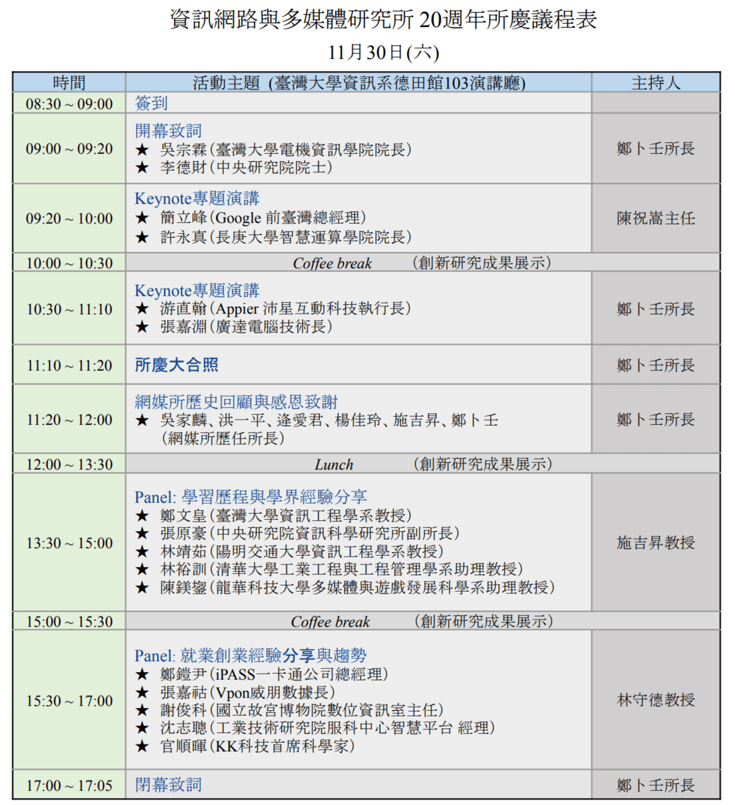

網媒所所慶  
===  

  

## 開幕致詞  

報名 170~180 人，滿多的  
20 年前創立是非常有前瞻性的  
頂尖人才要負起社會責任  

## Keynote 專題演講 1  

### 簡立峰 Embracing the AI Revolution  

<!-- Google 在台灣有很多員工。 -->  
#### AI 的發展  
網路在 2004 左右成立時很夯，而現在最夯的是 AI。AI 的差別是集中在少數國家的少數企業。  
Google CEO: 新的 code 有 25% 是 AI 生成的。未來 review code 的時間會比寫 code 的時間還多。  
* 用 AI 做對話式的電商，像是在跟老闆聊天。轉換率提升，客服成本降低。  
* AI 同事: 翻譯、搬運工、司機，搶走工作。waymo、蘿蔔快跑、Amazon 倉儲。82法則以後會變1:99法則，更極端。[AI steals 21% of freelance jobs.](https://qz.com/chatgpt-ai-steals-jobs-freelancers-1851557134)  
  * coding  
  * writing  
  * graphic design  
* AI 老師: AI 家教(Ex: [notebooklm](https://notebooklm.google.com))，摘要複習、考前猜題。AI 發展就像原子彈。  

AI 發展很集中，世界十大企業大多都與 AI 有關。  
Eric Schmidt 評價 Taiwan: Amazing hardware, software is terrible.  

#### 台灣的機會  

* AI Models  
* Cloud AI  
* **Edge AI**  
* **Robotics+AI**  

台灣做了很多硬體，如果能整合智慧，就是很大的機會。  

應用: 攝影機+多模態AI幫忙找東西。如果能有很小的模型整合進 Webcam，就能做很多事情。  

### 許永真 When AI meets multimedia  

symbolic AI -> ML+HCI -> Human-AI team  
解釋迷因  
CalliGAN 產生書法: 大模型很重要，但運用 domain knowledge 也很重要。  
小孩的動作 yolo 很難偵測，因為衣服、動作都很奇怪，所以特別寫了一個模型偵測。  
描述圖片很生動，可以辨識情緒。SUNO 幫忙生成網媒所 20 週年歌曲。  
TAIDE: 可信任 AI 對話引擎。  
AI 比 醫生更會診斷疾病。AI 比 90% 的人更會寫作。  

## Keynote 專題演講 2  

### 游直翰(Appier 共同創辦人) Appier 的 AI 創新之旅  

創業經驗、產業為主  
一開始做機器狗、自駕、自適應義肢等  
契機: 雖然自駕研究做很多，但還是無法自動開車。  
一開始針對遊戲設計的 AI 引擎  
後來主要是專注於 B2B 的數位行銷  

#### 創業的經驗、學習  

* 要以市場導向  
  * 以前: 科技、應用、市場  
  * 現在: 市場、應用、科技  
* 勇於嘗試、快速試錯  
* 市場規模至關重要，有些創業者會 care 自己是不是第一個做的，但創投可能更在意市場規模  
* 多元化: 大家都講英文，但是還是有文化差異，ex: 「還不錯」可能意思不一樣。  
* 堅持: 一開始營收很少，甚至還想跟學界拿錢，軒田說還是第一次看到業界向學界要錢。  
* 企業與顧客溝通，往往花很多成本，現在還是很傳統，主要是 email，加上電話。希望能夠有廣告等個人化的溝通形式。  

#### AI 與行銷  

自動化、個人化  
生成式又創造新的機會  

#### 行銷漏斗  

從上面開始，像漏斗一樣，最上面把可能有興趣的人都抓進來，最後留下來的才會付錢。  

### 張家淵(廣達電腦技術長)  

廣達往往在做認為該做的事，然後就變成先行者，比如雲端運算、AI。  
當初林百里剛畢業就想要做出 mobile 的電腦等等的歷史 -> mobile computing，後來是 cloud computing、AI。  
著眼點不一定是應用，有可能是一種天真的想像，像是 2007 就土砲出上面裝滿感測器、server 的自駕車，這也是廣達後來能與 TESLA 合作的原因之一。  

過去往往是希望找到簡單的模型解釋一切，像是牛頓的物理學。現在想要用大資料配上模仿神經打造的模型。  

少一點 artificial，intelligence 會好一點: meta verse、數位孿生  

林肯: 如果政府是人民的、由人民組成、為了人民，那就不會倒掉。AI 也是要為人服務。  

## Panel 學習歷程與學界經驗分享  

#### 鄭文皇  

宏達電 MagicLab，每個領域只有少數幾個人(maybe 3)，想辦法搞出一支手機。  

#### 林裕訓  

工作時也找偏向研究的，這樣比較容易回學界。博班寫 paper: ~~I'll try my best~~ Just do it! 就像 Whiplash 中說 Good job 不是一件好事，代表你無法達到 Great。  

##### How to do good research work  

You and your resesarch, **Richard Hamming**  
* Why do so few scientists make significant contributions and so many are forgotten in the long run  
* If what you are working on is not important and not likely to lead to important things, then why are you working on it?  
* It is not sufficient to do a job, you have to sell it.  

##### Ray Dalio TED talk  

I am right -> How do I know I am right?  

### 陳鎂鋆  

純藝術背景  
博士資格考: 選了大家最推的作業系統，但第一科就沒過，每一學期準備一科拼命考。  
選學界而不是業界，大概是因為有教學熱誠。  
進大學任教後就沒空做研究了，對於喜歡研究的人應該珍惜能夠專心做研究的時候。  

### 張原豪  

老師不給寫爛論文，說要畢業時再寫就好，要分清楚 Good to have 和 must have  
貧窮限制你的想像  

### 林靖茹  

Fake it till you make it  
勉勵本土學生要有自信  

### 提問  

國際會議時演講反而不是最重要，Coffee break 時認識人比較重要。  
內向的人可以點點頭、交換名片、寄 email 開始，或是加入小圈圈，別人在講話時點點頭刷存在感也好。不一定要去找大佬，因為很有可能將來身邊的人就變成大佬。  

## Panel 就業創業經驗分享與趨勢  

### 對未來影響最大的經歷或契機  

碩博班最重要的是方法論，解決問題。  
探索新事物  

### 重來的話想改變什麼  

認識更多人，多交流。  
會懷疑要不要邊工作邊讀博士，還有的碩士升職比他自己快。但是讀書可以擴展眼界，還是值得讀。  
學習團隊合作，因為就業時也很重要。  
工作很痛苦，要珍惜讀書時光。  

### 應對 AI 時代  

努力做新的事情。  
珍惜自己的時間，因為如果有人要用就算很多錢買你一年的時間，你大概會拒絕。  
最終，人都是要服務人的，要關注人。  

### 就學、就業時最迷茫的時刻  

讀 PhD 時換了工作，覺得好像用不太到。沒動力的時候找個有動力的人幫忙拉就可以了(or 別執著自己解決)。  
在業界無法有找方向的自由，尤其是公家機關，努力把自己在做的事做好就好。  
多找找看新的機會、新的方向。  
你會覺得人生很困難，但又要做出有意義的事情。解法: Steve jobs 的 connect the dots，不要試著預測未來，某種程度上不管做出什麼決定都是對的。  

### 是否有用到 AI 寫 code  

可以用來把別的語言開源的內容轉成自己的語言。  
一卡通以前甚至會要一個人寫完 code 關掉，另一個人才能繼續寫，現在可以用 Copilot 寫 code。自動化(數位轉型)可以帶來很大的效益。不是工作被取代，而是效率變高所以能做更多事，雖然需要的人變少但可能整體市場規模變大。  

### 吳老師的重要呼籲  

焦慮、恐慌時不要猶豫 call for help。  
比如在心理影響生理時，大概就有很大的問題了。  

## 研究成果展示  
<!-- 待補  -->  